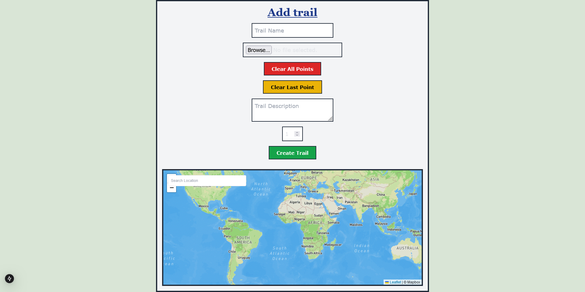
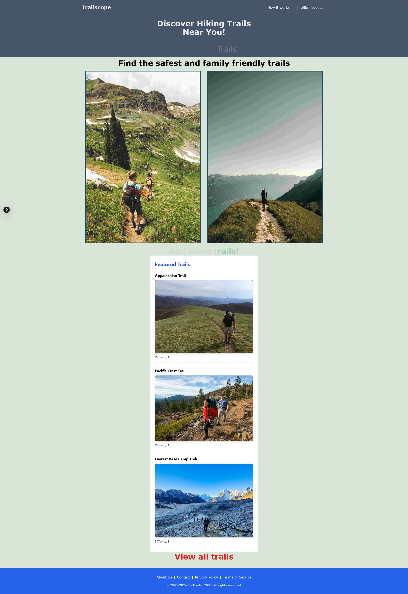
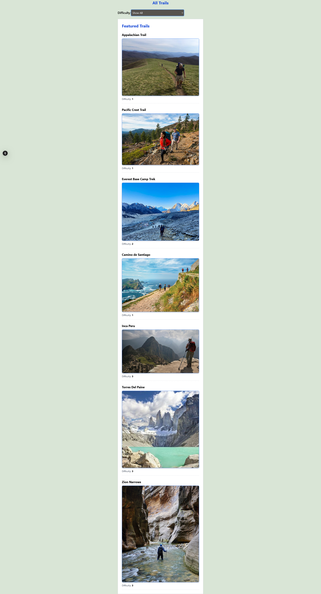
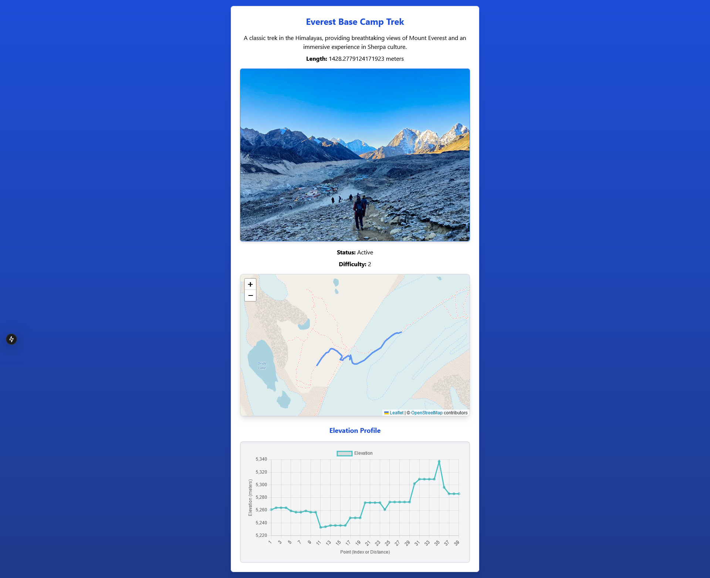

# TrailScope

TrailScope is an interactive platform that allows users to create, analyze, and explore trails. It leverages Django for the backend and Next.js for the frontend to offer a seamless and intuitive user experience.

## Features

- **Trail Creation**: Create personalized trails by placing waypoints on an interactive map.
- **Trail Metrics**: Automatically calculates trail length and generates an elevation profile.
- **Map Interaction**: Fully interactive map to help users visualize trails in real-time.
- **Trail Submission**: Save your trail data securely for future use or sharing.

## How It Works

### 1. Creating a Trail

When you visit TrailScope, you can start by creating your own trail by interacting with an interactive map. Simply click on the map to place waypoints (coordinates), and these will form the path of your trail. You’ll also be able to add important details like the trail’s name, description, and difficulty rating (on a scale of 1 to 5).



### 2. Trail Metrics

As you define your trail, we automatically calculate important metrics, including the **trail length** and an **elevation profile**. The trail length is calculated by measuring the distance between each consecutive waypoint. Additionally, we fetch elevation data from an external service to generate an elevation profile, showing how the terrain changes along the trail.



### 3. Submitting Your Trail

Once you’ve completed your trail and reviewed the metrics, you can submit it to be securely stored in our system. Your trail data, including coordinates, elevation profile, and length, will be saved and accessible for future use or sharing.



### 4. Map Interaction

The map is fully interactive, allowing you to zoom in and out, move around, and click to place waypoints. As you click, a line is drawn on the map to visualize your trail in real-time, helping you track your progress and plan the best route.



### 5. Explore and Create Your Own Trail!

With TrailScope, planning, creating, and analyzing trails is simple and efficient. Whether you’re creating a new hiking path or exploring existing trails, our platform provides all the tools you need to enhance your outdoor adventures.

## Tech Stack

- **Backend**: Django, Django REST Framework, PostgreSQL (PostGIS for GIS functionality), Docker
- **Frontend**: Next.js, React, Tailwind CSS, Mapbox for interactive maps


## Getting Started

### Prerequisites

Make sure you have the following tools installed:

- Python 3.x
- Node.js (with npm or yarn)
- PostgreSQL (with PostGIS enabled for GIS support)

### Backend Setup

1. Clone the backend repository:

    ```bash
    git clone https://github.com/konuamah/trailscope.git
    cd trailscope/backend
    ```

2. Create a virtual environment and install dependencies:

    ```bash
    python -m venv env
    source env/bin/activate  # On Windows, use `env\Scripts\activate`
    pip install -r requirements.txt
    ```

3. Set up environment variables for the database and other configurations in `.env`.

4. Run the migrations to set up the database:

    ```bash
    python manage.py migrate
    ```

5. Start the backend server:

    ```bash
    python manage.py runserver
    ```

### Frontend Setup

1. Navigate to the frontend directory:

    ```bash
    cd frontend
    ```

2. Install dependencies:

    ```bash
    npm install  # or yarn install
    ```

3. Start the Next.js development server:

    ```bash
    npm run dev  # or yarn dev
    ```

This project is licensed under the MIT License - see the [LICENSE](LICENSE) file for details.
